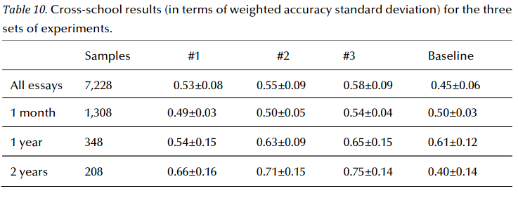
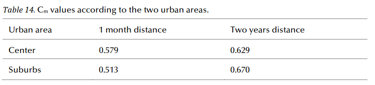

Our paper <i>'A NLP-based stylometric approach for tracking the evolution of L1 written language compentece'</i> (with Dominique Brunato and Felice Dell'Orletta) is finally out and will feature in the next issue of JoWR! In this paper we demonstrated that linguistic features automatically extracted from text not only allow making explicit the relevant transformations occurring in L1 learners’ writing competence but can be exploited as effective predictors in the automatic classification of the chronological order of essays written by the same student, especially at more distant temporal spans.   We showed that features related to the error annotation, as well as features belonging to the use of grammatical categories and to the inflectional properties of verbs, acquire much more relevance as the temporal span increase.   Finally, we found that the student'slearning curve varies according at least to the geographical area where the school is located: when a higher temporal span is considered, the classifier is more confident about its decision for texts written by students who belong to suburban schools. 
